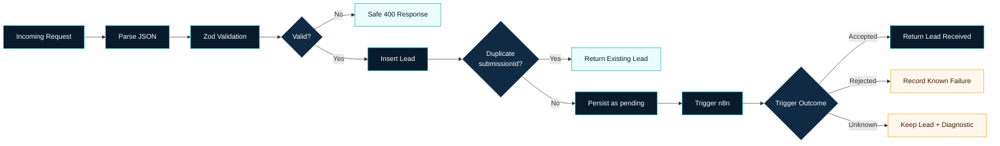
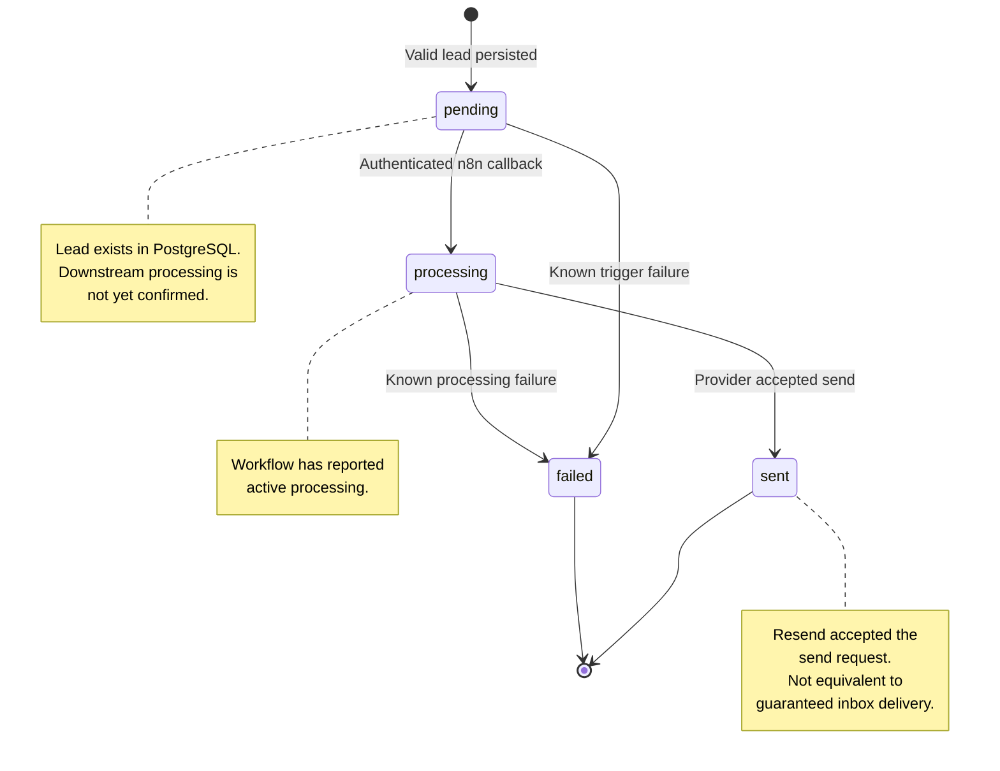
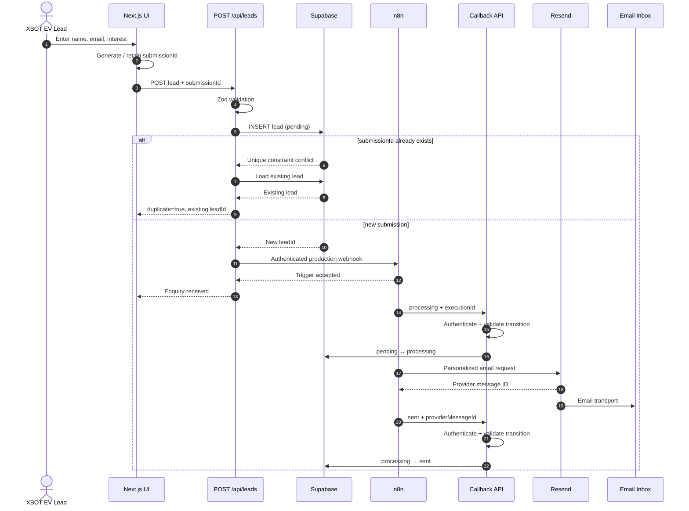
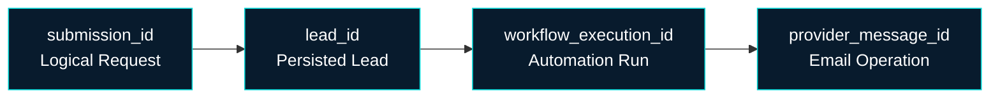
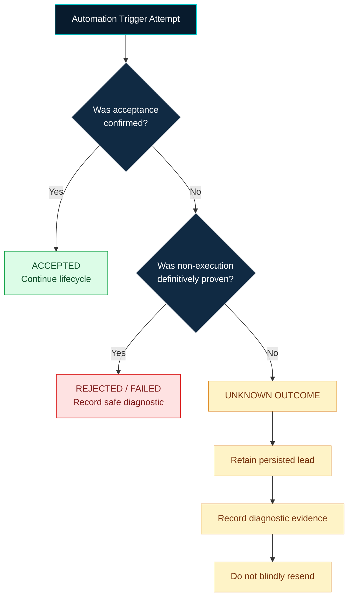
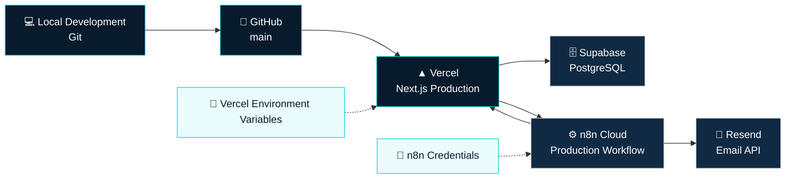

# XBOT EV — System Architecture

> **Production-oriented lead capture and automated response architecture**  
> Next.js · Supabase PostgreSQL · n8n · Resend · Vercel

**Live Application:** https://xbot-task-4.vercel.app  
**Repository:** https://github.com/Shoaibstat876/xbot-task-4

---

## Architecture at a Glance

The XBOT EV Lead Response System is designed around one core principle:

> **Persist the lead first, then automate — while keeping privileged operations behind trusted server boundaries.**

```mermaid
flowchart LR

    %% =========================
    %% XBOT EV — MAIN ARCHITECTURE
    %% =========================

    U["👤 Visitor<br/><b>XBOT EV Lead</b>"]

    subgraph CLIENT["CLIENT EXPERIENCE"]
        direction TB
        UI["⚡ XBOT EV Interface<br/><b>Next.js + React</b><br/>Responsive enquiry form"]
        UUID["🆔 Submission Identity<br/><b>submissionId UUID</b><br/>Duplicate protection"]
    end

    subgraph APP["TRUSTED APPLICATION BOUNDARY"]
        direction TB
        API["🛡️ Lead API<br/><b>POST /api/leads</b>"]
        ZOD["✅ Zod Validation<br/>Name · Email · Interest · UUID"]
        LOGIC["⚙️ Lead Orchestration<br/>Persist → Trigger → Classify Outcome"]
        CALLBACK["🔐 Lifecycle Callback API<br/><b>POST /api/automation/callback</b>"]
        STATE["🧠 State Policy<br/>Authentication · Validation<br/>Transition Guard"]
    end

    subgraph DATA["PERSISTENCE LAYER"]
        direction TB
        DB[("🗄️ Supabase PostgreSQL<br/><b>public.leads</b>")]
        TRACE["📍 Traceability<br/>lead_id<br/>submission_id<br/>workflow_execution_id<br/>provider_message_id"]
    end

    subgraph AUTOMATION["AUTOMATION LAYER"]
        direction TB
        WEBHOOK["🔑 Authenticated n8n Webhook"]
        PROCESS["🔄 Processing Callback<br/><b>pending → processing</b>"]
        EDIT["✉️ Deterministic Personalization<br/>Name + Stated Interest"]
        RESEND["📨 Resend API<br/>Transactional Email"]
        SENT["✅ Sent Callback<br/><b>processing → sent</b>"]
    end

    subgraph RECIPIENT["CUSTOMER RESPONSE"]
        MAIL["📬 Lead Email Inbox<br/>Personalized XBOT EV Response"]
    end

    U --> UI
    UI --> UUID
    UUID -->|"HTTPS JSON"| API
    API --> ZOD
    ZOD --> LOGIC
    LOGIC -->|"1. Persist"| DB
    DB --> TRACE
    LOGIC -->|"2. Authenticated Trigger"| WEBHOOK

    WEBHOOK --> PROCESS
    PROCESS -->|"x-xbot-callback-key"| CALLBACK
    CALLBACK --> STATE
    STATE -->|"Conditional Update"| DB

    WEBHOOK --> EDIT
    EDIT --> RESEND
    RESEND --> MAIL
    RESEND --> SENT
    SENT -->|"Provider ID + Execution ID"| CALLBACK

    classDef user fill:#F8FAFC,stroke:#00D4D4,stroke-width:2px,color:#081B2D;
    classDef client fill:#0D2940,stroke:#00D4D4,stroke-width:2px,color:#FFFFFF;
    classDef server fill:#081B2D,stroke:#00D4D4,stroke-width:2px,color:#FFFFFF;
    classDef data fill:#152534,stroke:#C8CDD3,stroke-width:2px,color:#FFFFFF;
    classDef automation fill:#102A43,stroke:#00D4D4,stroke-width:2px,color:#FFFFFF;
    classDef mail fill:#F1F5F9,stroke:#081B2D,stroke-width:2px,color:#081B2D;

    class U user;
    class UI,UUID client;
    class API,ZOD,LOGIC,CALLBACK,STATE server;
    class DB,TRACE data;
    class WEBHOOK,PROCESS,EDIT,RESEND,SENT automation;
    class MAIL mail;

    style CLIENT fill:#071827,stroke:#00D4D4,stroke-width:1px
    style APP fill:#06131F,stroke:#00D4D4,stroke-width:1px
    style DATA fill:#101A24,stroke:#C8CDD3,stroke-width:1px
    style AUTOMATION fill:#071827,stroke:#00D4D4,stroke-width:1px
    style RECIPIENT fill:#F8FAFC,stroke:#081B2D,stroke-width:1px
```



---

## Architectural Objective

The assessment requires a working automation that receives a lead and automatically sends a personalized response containing the lead's **name** and **stated interest**.

The architecture extends that requirement into a small but defensible production-oriented system:

```text
Lead Capture
     ↓
Server Validation
     ↓
Durable Persistence
     ↓
Authenticated Automation
     ↓
Personalized Email
     ↓
Lifecycle Synchronization
     ↓
Operational Traceability
```

The design deliberately avoids unnecessary infrastructure while preserving the engineering controls that materially improve reliability, security, and evaluator visibility.

---

## Architectural Principles

| Principle | Implementation |
|---|---|
| Browser is untrusted | Privileged operations remain server-side |
| Validate authoritatively | Zod validation occurs inside the API |
| Persist before automating | Lead exists before n8n is triggered |
| Least exposure of secrets | Credentials remain in Vercel/n8n/server environment |
| One lifecycle authority | Next.js callback validates database state transitions |
| Unknown is not failure | Timeouts do not automatically become `failed` |
| Provider acceptance is not delivery | `sent` has a precise technical meaning |
| Authentication is not idempotency | Submission UUID + PostgreSQL uniqueness |
| Evidence before claims | State and external identifiers are persisted |
| Smallest complete architecture | No unnecessary microservices, LLM, RAG, queues, or agents |

---

# Component Architecture

## 1. XBOT EV Frontend

**Technology**

```text
Next.js 16
React
TypeScript
Tailwind CSS
```

The frontend owns presentation and temporary interaction state only.

Responsibilities:

```text
render XBOT EV experience
collect lead input
generate submissionId
show validation feedback
disable active submissions
show safe success/error state
maintain responsive UX
```

The frontend does **not** own:

```text
database credentials
database lifecycle mutation
n8n authentication
callback authentication
email provider credentials
authoritative validation
```

The form collects:

```text
name
email
interest
```

and internally attaches:

```text
submissionId
```

Example request:

```json
{
  "name": "Example User",
  "email": "user@example.com",
  "interest": "I would like more information about XBOT EV.",
  "submissionId": "550e8400-e29b-41d4-a716-446655440000"
}
```

---

## 2. Lead API

Endpoint:

```http
POST /api/leads
```

This endpoint forms the principal trusted boundary between the browser and the backend.

Its execution order is:



The API performs four critical functions:

```text
validation
persistence
idempotency
automation orchestration
```

---

# Persistence Architecture

## Supabase PostgreSQL

Primary table:

```text
public.leads
```

Core persisted model:

| Field | Architectural Role |
|---|---|
| `lead_id` | Persistent application identity |
| `name` | Lead name |
| `email` | Lead response destination |
| `interest` | Lead's stated interest |
| `submission_id` | Client logical-request identity |
| `response_status` | Current lifecycle state |
| `created_at` | Lead creation time |
| `updated_at` | Record update time |
| `workflow_execution_id` | n8n trace |
| `provider_message_id` | Resend operation trace |
| `response_sent_at` | Successful provider-acceptance time |
| `error_code` | Safe diagnostic |

The key architectural decision is:

```text
VALIDATE
   ↓
PERSIST
   ↓
AUTOMATE
```

rather than:

```text
AUTOMATE
   ↓
PERSIST IF SUCCESSFUL
```

This protects XBOT EV from losing a valid enquiry simply because an external workflow dependency has a temporary problem.

---

# Lifecycle Architecture

The canonical state machine is:



### `pending`

Means:

> The valid lead exists in trusted persistent storage, while downstream automation has not yet reached a verified completed stage.

### `processing`

Means:

> Authenticated workflow evidence indicates automation processing has begun.

The application can persist:

```text
workflow_execution_id
```

at this point.

### `sent`

Means:

> The email provider accepted the send operation successfully.

It does **not** mean:

```text
guaranteed inbox delivery
message read by recipient
customer engagement
```

### `failed`

Used only when failure is sufficiently established.

The architecture avoids converting uncertainty into false failure.

---

# End-to-End Sequence



This sequence makes the trust model explicit:

```text
browser does not update lifecycle state directly
n8n does not blindly overwrite database state
provider response is synchronized through trusted application policy
```

---

# Automation Architecture

The published n8n production workflow is:

```text
Webhook
   ↓
Processing Callback
   ↓
Edit Fields
   ↓
Resend HTTP Request
   ↓
Sent Callback
```

### Production webhook

The Next.js backend calls the production workflow using:

```text
N8N_WEBHOOK_URL
```

with:

```text
x-xbot-automation-key
```

authenticated by:

```text
N8N_WEBHOOK_SECRET
```

The browser never sees this secret.

### Processing callback

n8n calls:

```http
POST /api/automation/callback
```

with:

```json
{
  "leadId": "<lead-id>",
  "status": "processing",
  "workflowExecutionId": "<execution-id>"
}
```

Authentication header:

```text
x-xbot-callback-key
```

expected secret:

```text
N8N_CALLBACK_SECRET
```

### Email preparation

The email uses values from the original webhook payload.

The workflow deliberately uses deterministic personalization rather than an LLM.

Conceptual message:

```text
Hello <name>,

Thank you for your interest in <interest>.

We've received your enquiry and the XBOT EV team will follow up regarding the next step.

XBOT EV
```

### Resend

Request:

```http
POST https://api.resend.com/emails
```

The Resend Authorization value is stored using n8n credential management.

### Sent callback

After provider acceptance:

```json
{
  "leadId": "<lead-id>",
  "status": "sent",
  "providerMessageId": "<resend-provider-id>",
  "workflowExecutionId": "<execution-id>"
}
```

The application validates the transition before updating PostgreSQL.

---

# Trust Boundary Diagram

```mermaid
flowchart TB

    subgraph PUBLIC["🌐 PUBLIC / UNTRUSTED"]
        Browser["Browser<br/>XBOT EV Visitor"]
    end

    subgraph SERVER["🔒 TRUSTED APPLICATION"]
        Next["Next.js Server<br/>API Routes"]
        Secrets["Vercel Environment<br/>Private Credentials"]
    end

    subgraph STORAGE["🗄️ TRUSTED DATA"]
        Supabase["Supabase PostgreSQL"]
    end

    subgraph AUTOMATION["⚙️ CONTROLLED EXTERNAL AUTOMATION"]
        N8N["n8n Cloud"]
        N8NCred["n8n Credential Store"]
    end

    subgraph PROVIDER["📨 EXTERNAL PROVIDER"]
        Resend["Resend API"]
    end

    Browser -->|"Public HTTPS"| Next
    Secrets -.->|"Server only"| Next
    Next -->|"Privileged DB access"| Supabase
    Next -->|"Authenticated webhook"| N8N
    N8N -->|"Authenticated callback"| Next
    N8NCred -.->|"Authorization credential"| Resend
    N8N -->|"Email API request"| Resend

    classDef public fill:#F8FAFC,stroke:#64748B,color:#0F172A;
    classDef trusted fill:#081B2D,stroke:#00D4D4,color:#FFFFFF;
    classDef ext fill:#102A43,stroke:#C8CDD3,color:#FFFFFF;

    class Browser public;
    class Next,Secrets,Supabase trusted;
    class N8N,N8NCred,Resend ext;

    style PUBLIC fill:#F8FAFC,stroke:#94A3B8
    style SERVER fill:#071827,stroke:#00D4D4
    style STORAGE fill:#071827,stroke:#00D4D4
    style AUTOMATION fill:#0D1F2D,stroke:#C8CDD3
    style PROVIDER fill:#0D1F2D,stroke:#C8CDD3
```



The security rule is simple:

> Privileged credentials never cross into the browser trust boundary.

---

# Idempotency and Duplicate Protection

The architecture uses four distinct identifiers:

```text
submission_id
lead_id
workflow_execution_id
provider_message_id
```

They are not interchangeable.



The database uniqueness rule is:

```sql
create unique index if not exists leads_submission_id_unique
on public.leads (submission_id)
where submission_id is not null;
```

If two requests contain the same `submissionId`:

```text
Request A
submissionId = X
        ↓
lead created
        ↓
automation triggered

Request B
submissionId = X
        ↓
unique conflict
        ↓
existing lead returned
        ↓
NO second automation trigger
```

This provides stronger protection than relying only on a disabled frontend button.

---

# Failure Architecture

The automation trigger has three semantic results:

```text
ACCEPTED
REJECTED
UNKNOWN
```



The architecture therefore enforces:

> **Timeout is not proof of failure.**

A request could have reached n8n even if the acknowledgement was lost.

Blind retry would risk duplicate messaging.

---

# Callback Integrity

The callback architecture follows:

```text
Incoming callback
      ↓
Authenticate
      ↓
Validate payload
      ↓
Check lead
      ↓
Check persisted current state
      ↓
Validate requested transition
      ↓
Conditional mutation
      ↓
Return safe response
```

It deliberately avoids:

```text
Incoming callback
      ↓
Direct status overwrite
```

Verified protection includes:

```text
unauthenticated callback → rejected

invalid UUID → HTTP 400

sent → processing → HTTP 409
```

This prevents a stale or malicious callback from casually rewriting lifecycle truth.

---

# Deployment Architecture



Production environment variables:

```text
SUPABASE_URL
SUPABASE_SECRET_KEY
N8N_WEBHOOK_URL
N8N_WEBHOOK_SECRET
N8N_CALLBACK_SECRET
```

The Resend API key is stored separately inside n8n credential management.

---

# Architecture Trade-offs

The design deliberately does **not** introduce:

```text
FastAPI microservice
Redis
Kafka
RabbitMQ
RAG
vector database
LLM
AI agent
microservice mesh
Kubernetes
distributed event bus
```

because none is necessary for the verified assessment requirement.

Adding these technologies would increase:

```text
deployment complexity
failure surface
credential management
maintenance overhead
evaluation difficulty
```

without materially improving the required workflow.

The selected architecture provides:

```text
real backend logic
real persistence
real automation
real transactional email
secure privileged boundaries
observable lifecycle
duplicate safety
production deployment
```

with much lower complexity.

---

# Known Durability Boundary

The current application uses:

```text
persist lead
     ↓
trigger n8n
```

without a transactional outbox or durable message queue.

Therefore it does **not** claim:

```text
exactly-once distributed delivery
guaranteed asynchronous execution
enterprise queue durability
```

The current implementation is appropriate to the assessment scope.

A larger production deployment could introduce:

```text
transactional outbox
durable queue
retry worker
dead-letter queue
provider-event reconciliation
```

if stronger asynchronous guarantees became necessary.

---

# Current Provider-Failure Boundary

The callback API supports:

```text
processing → failed
```

but the currently demonstrated primary n8n workflow is:

```text
Webhook
→ Processing Callback
→ Edit Fields
→ Resend
→ Sent Callback
```

An explicit Resend-error branch that automatically performs a `failed` callback is a reasonable future hardening step, but it is **not claimed as production-verified** in the current implementation.

This is intentional claim governance.

---

# Production Evidence

The production architecture has already demonstrated successful full-path executions.

A successfully completed record contains:

```text
response_status       = sent
workflow_execution_id = populated
provider_message_id   = populated
response_sent_at      = populated
error_code            = NULL
```

Representative production n8n executions included:

```text
21
22
23
```

A production verification also produced a real Resend provider identifier:

```text
580f7581-f72f-4844-b37c-f731c6ca41b3
```

The credential-hardening production run remained successful after moving the Resend Authorization key into n8n credential storage.

Actual inbox receipt was also manually verified.

---

# Architecture Quality Gates

The architecture is considered healthy when the following chain can be proven:

```text
XBOT EV Form
     ↓
Next.js API
     ↓
Server Validation
     ↓
PostgreSQL Persistence
     ↓
Authenticated Automation Trigger
     ↓
n8n Execution
     ↓
Processing Callback
     ↓
Personalized Response
     ↓
Resend Provider Acceptance
     ↓
Sent Callback
     ↓
Persisted Final Lifecycle State
```

The system additionally verifies:

```text
unauthorized callbacks are rejected
invalid state transitions are rejected
invalid callback data is rejected
duplicate submissions reuse the existing logical lead
secrets remain outside the browser
production build succeeds
lint succeeds
responsive UX remains stable
```

---

# Final Architecture Summary

```text
┌──────────────────────────────────────────────────────────────────────┐
│                              XBOT EV                                 │
│                                                                      │
│  Visitor                                                             │
│     │                                                                │
│     ▼                                                                │
│  Premium Responsive Lead Experience                                  │
│     │                                                                │
│     ▼                                                                │
│  Submission UUID                                                     │
│     │                                                                │
│     ▼                                                                │
│  Next.js Trusted Server API                                          │
│     │                                                                │
│     ├── Validate                                                     │
│     ├── Persist                                                      │
│     ├── Protect Duplicates                                           │
│     └── Authenticate Automation                                      │
│                                                                      │
│     ▼                                                                │
│  Supabase PostgreSQL                                                 │
│     │                                                                │
│     │ pending                                                        │
│     ▼                                                                │
│  n8n Production Automation                                           │
│     │                                                                │
│     ├── processing callback                                          │
│     ├── deterministic personalization                                │
│     ├── Resend email                                                 │
│     └── sent callback                                                │
│                                                                      │
│     ▼                                                                │
│  Application Lifecycle Policy                                        │
│     │                                                                │
│     ├── authentication                                               │
│     ├── validation                                                   │
│     ├── conditional transition                                       │
│     └── trace persistence                                            │
│                                                                      │
│     ▼                                                                │
│  Final Lead Record                                                   │
│                                                                      │
│  sent + workflow ID + provider ID + timestamp                        │
└──────────────────────────────────────────────────────────────────────┘
```

The resulting architecture is built around:

```text
SECURE SERVER BOUNDARIES
        +
DURABLE LEAD PERSISTENCE
        +
VISIBLE AUTOMATION
        +
TRUTHFUL STATE SEMANTICS
        +
DETERMINISTIC PERSONALIZATION
        +
TRACEABLE PROVIDER RESULT
        +
DATABASE-LEVEL IDEMPOTENCY
        +
PRODUCTION DEPLOYMENT
```

The system intentionally remains small, explainable, reproducible, and appropriate for the XBOT EV assessment while demonstrating production-oriented thinking around security, reliability, observability, lifecycle integrity, and failure semantics.

---

**XBOT EV — Automated Lead Response Architecture**